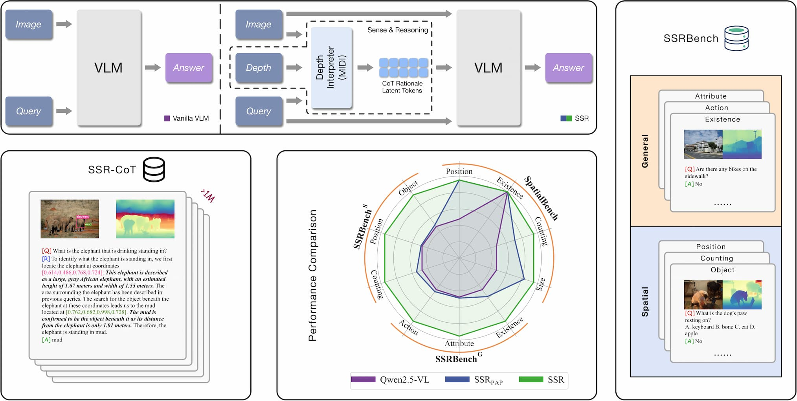

# 🎬 SSR: Enhancing Depth Perception in Vision-Language Models via Rationale-Guided Spatial Reasoning

[SSR: Enhancing Depth Perception in Vision-Language Models via Rationale-Guided Spatial Reasoning](https://arxiv.org/abs/2505.12448)

[Yang Liu*](https://yliu-cs.github.io), Ming Ma*, Xiaomin Yu*, [Pengxiang Ding](https://dingpx.github.io), [Han Zhao](https://h-zhao1997.github.io), Mingyang Sun, [Siteng Huang](https://kyonhuang.top), [Donglin Wang](https://milab.westlake.edu.cn)



Despite impressive advancements in Visual-Language Models (VLMs) for multi-modal tasks, their reliance on RGB inputs limits precise spatial understanding. Existing methods for integrating spatial cues, such as point clouds or depth, either require specialized sensors or fail to effectively exploit depth information for higher-order reasoning. To this end, we propose a novel Spatial Sense and Reasoning method, dubbed SSR, a novel framework that transforms raw depth data into structured, interpretable textual rationales. These textual rationales serve as meaningful intermediate representations to significantly enhance spatial reasoning capabilities. Additionally, we leverage knowledge distillation to compress the generated rationales into compact latent embeddings, which facilitate resource-efficient and plug-and-play integration into existing VLMs without retraining. To enable comprehensive evaluation, we introduce a new dataset named SSR-CoT, a million-scale visual-language reasoning dataset enriched with intermediate spatial reasoning annotations, and present SSRBench, a comprehensive multi-task benchmark. Extensive experiments on multiple benchmarks demonstrate SSR substantially improves depth utilization and enhances spatial reasoning, thereby advancing VLMs toward more human-like multi-modal understanding.

## 🗄️ Dataset SSR-CoT and Benchmark SSRBench

Coming Soon ...

## 🏠 Installation

```sh
git clone https://github.com/yliu-cs/SSR.git
conda create -n SSR python=3.11
conda activate SSR
cd SSR

pip install -r requirements.txt
```

## 💎 Model Checkpoint

Coming Soon ...

## ✴️ Training & Inference

```sh
# Training Stage 1
accelerate launch --config_file "scripts/fsdp.yaml" ssr/train/train_reasoning.py

# Training Stage 2
accelerate launch --config_file "scripts/fsdp.yaml" ssr/train/train_vlm.py --lora --llava

# Inference
# Coming Soon ...
```

## ❤️ Acknowledgment

Thanks [Meteor](https://github.com/ByungKwanLee/Meteor), [SpatialBot](https://github.com/BAAI-DCAI/SpatialBot), [SpatialRGPT](https://github.com/AnjieCheng/SpatialRGPT) for their excellent code implementations, which aided later study and are referenced in this implementation as available source code.

## 📜 Citation

Please cite our paper if you use PiTe in your work:

```bibtex
@article{journals/corr/abs-2505-12448,
  author       = {Yang Liu and Ming Ma and Xiaomin Yu and Pengxiang Ding and Han Zhao and Mingyang Sun and Siteng Huang and Donglin Wang},
  title        = {SSR: Enhancing Depth Perception in Vision-Language Models via Rationale-Guided Spatial Reasoning},
  journal      = {CoRR},
  volume       = {abs/2505.12448},
  year         = {2025},
}
```
