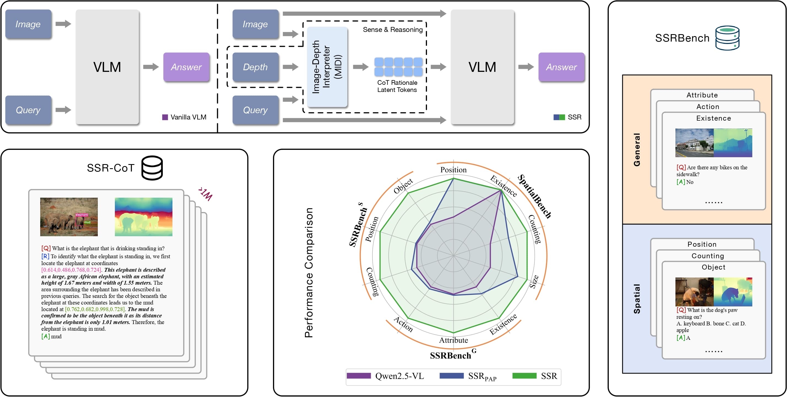

# 🔍 SSR: Enhancing Depth Perception in Vision-Language Models via Rationale-Guided Spatial Reasoning (NeurIPS 2025)

[SSR: Enhancing Depth Perception in Vision-Language Models via Rationale-Guided Spatial Reasoning](https://arxiv.org/abs/2505.12448)

[Yang Liu*](https://yliu-cs.github.io), Ming Ma*, Xiaomin Yu*, [Pengxiang Ding](https://dingpx.github.io), [Han Zhao](https://h-zhao1997.github.io), Mingyang Sun, [Siteng Huang](https://kyonhuang.top), [Donglin Wang](https://milab.westlake.edu.cn)

[](https://arxiv.org/abs/2505.12448)
[](https://yliu-cs.github.io/SSR)
[](https://huggingface.co/collections/yliu-cs/ssr-682d44496b64e4edd94092bb)



Despite impressive advancements in Visual-Language Models (VLMs) for multi-modal tasks, their reliance on RGB inputs limits precise spatial understanding. Existing methods for integrating spatial cues, such as point clouds or depth, either require specialized sensors or fail to effectively exploit depth information for higher-order reasoning. To this end, we propose a novel Spatial Sense and Reasoning method, dubbed SSR, a novel framework that transforms raw depth data into structured, interpretable textual rationales. These textual rationales serve as meaningful intermediate representations to significantly enhance spatial reasoning capabilities. Additionally, we leverage knowledge distillation to compress the generated rationales into compact latent embeddings, which facilitate resource-efficient and plug-and-play integration into existing VLMs without retraining. To enable comprehensive evaluation, we introduce a new dataset named SSR-CoT, a million-scale visual-language reasoning dataset enriched with intermediate spatial reasoning annotations, and present SSRBench, a comprehensive multi-task benchmark. Extensive experiments on multiple benchmarks demonstrate SSR substantially improves depth utilization and enhances spatial reasoning, thereby advancing VLMs toward more human-like multi-modal understanding.

## 📚 SSR-CoT Dataset

We collect the following four datasets:

* LLaVA-CoT [[link](https://github.com/PKU-YuanGroup/LLaVA-CoT)]
* Visual-CoT [[link](https://github.com/deepcs233/Visual-CoT)]
* VoCoT [[link](https://github.com/RupertLuo/VoCoT)]
* SpatialQA [[link](https://github.com/BAAI-DCAI/SpatialBot)]

The SSR-CoT dataset directory tree is shown as below:
```sh
SSR-CoT
|-- ssr-cot.jsonl
|-- LLaVA-CoT-100k
|   |-- CLEVR_v1.0
|   |-- CLEVR_v1.0_d  # contains depth
|   `-- ...
|-- Visual-CoT
|   `-- images
|-- VoCoT
|   `-- images
|-- SpatialQA
`   `-- images
```
`ssr-cot.jsonl` can be downloaded from [HuggingFace](https://huggingface.co/datasets/yliu-cs/SSR-CoT).

## 🏠 Installation

```sh
git clone https://github.com/yliu-cs/SSR.git
conda create -n SSR python=3.11
conda activate SSR
cd SSR

pip install -r requirements.txt
```

## 🚀 Training

```sh
# Training Stage 1
accelerate launch --config_file "scripts/fsdp.yaml" ssr/train/train_reasoning.py

# Training Stage 2
accelerate launch --config_file "scripts/fsdp.yaml" ssr/train/train_vlm.py --lora --llava
```

## 📷 Model Checkpoint

| Model   | URL                                                      | Model   | URL                                                      |
|---------|----------------------------------------------------------|---------|----------------------------------------------------------|
| MIDI 7B | [HuggingFace](https://huggingface.co/yliu-cs/SSR-MIDI-7B)| VLM 7B  | [HuggingFace](https://huggingface.co/yliu-cs/SSR-VLM-7B) |

## 🎯 Inference

```python
python infer.py
```

> Response: *The image features a young woman with long black hair, who is kneeling down by a pool of water. She appears to be interacting with the water, possibly splashing it or touching it with her hand. The woman is wearing a white dress, which complements the serene and refreshing atmosphere of the scene.*

## 👁️ SSRBench Benchmark

`ssrbench.json` can be downloaded from [HuggingFace](https://huggingface.co/datasets/yliu-cs/SSRBench).

LLM-Assistant evaluation can refer to the following function:

```python
def get_score(
    question: str
    , response: str
    , answer: str
    , llm: AutoModelForCausalLM
    , tokenizer: AutoTokenizer
) -> Tuple[str, float]:
    messages = [
        {
            "role": "system"
            , "content":
                "You are an intelligent chatbot designed for evaluating the correctness of generative outputs for question-answer pairs."
                "Your task is to compare the predicted answer with the correct answer and determine if they match meaningfully. Here's how you can accomplish the task:"
                "------"
                "##INSTRUCTIONS: "
                "- Focus on the meaningful match between the predicted answer and the correct answer.\n"
                "- Consider synonyms or paraphrases as valid matches.\n"
                "- Evaluate the correctness of the prediction compared to the answer."
        }
        , {
            "role": "user",
            "content":
                "Please evaluate the following image-based question-answer pair:\n\n"
                f"Question: {question}\n"
                f"Correct Answer: {answer}\n"
                f"Predicted Answer: {response}\n\n"
                "Provide your evaluation only as a yes/no and score where the score is an integer value between 0 and 5, with 5 indicating the highest meaningful match. "
                "Please generate the response in the form of a Python dictionary string with keys 'pred' and 'score', where value of 'pred' is  a string of 'yes' or 'no' and value of 'score' is in INTEGER, not STRING."
                "DO NOT PROVIDE ANY OTHER OUTPUT TEXT OR EXPLANATION. Only provide the Python dictionary string. "
                "For example, your response should look like this: {'pred': 'yes', 'score': 4.8}."
        }
    ]
    text = tokenizer.apply_chat_template(
        messages,
        tokenize=False,
        add_generation_prompt=True
    )
    while True:
        try:
            llm_inputs = tokenizer([text], return_tensors="pt").to(llm.device)
            generated_ids = llm.generate(**llm_inputs, max_new_tokens=256)
            generated_ids = [output_ids[len(input_ids):] for input_ids, output_ids in zip(llm_inputs.input_ids, generated_ids)]
            response = literal_eval(tokenizer.batch_decode(generated_ids, skip_special_tokens=True)[0])
            break
        except:
            continue
    return response["pred"], response["score"]
```

## ❤️ Acknowledgment

Thanks [Meteor](https://github.com/ByungKwanLee/Meteor), [SpatialBot](https://github.com/BAAI-DCAI/SpatialBot), [SpatialRGPT](https://github.com/AnjieCheng/SpatialRGPT) for their excellent code implementations, which aided later study and are referenced in this implementation as available source code.

## 📜 Citation

Please cite our paper if you use SSR in your work:

```bibtex
@article{journals/corr/abs-2505-12448,
  author       = {Yang Liu and Ming Ma and Xiaomin Yu and Pengxiang Ding and Han Zhao and Mingyang Sun and Siteng Huang and Donglin Wang},
  title        = {SSR: Enhancing Depth Perception in Vision-Language Models via Rationale-Guided Spatial Reasoning},
  journal      = {CoRR},
  volume       = {abs/2505.12448},
  year         = {2025},
}
```

